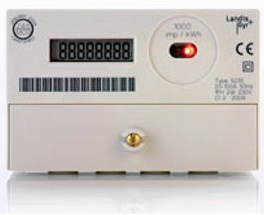
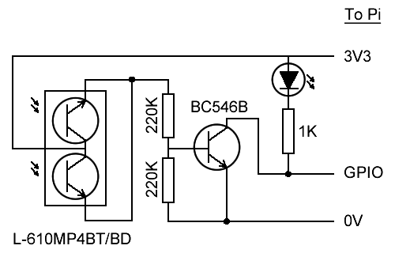

# Pi Meter

Monitoring an electricity meter with the Raspberry Pi. Based on the circuit published on [a link](http://mistertee-talks-electronics.blogspot.co.uk/2013/03/using-raspberry-pi-as-energy-monitor.html "MisterTee's Blog")

### Meter type:

The electricity meter has an LED which pulses once every time a watt of electricity is used.

### Circuit diagram:

## Summary

A log file (upCountDelta.txt) is used to store the system uptime (up), an integer (count) and the interval since the last pulse (interval).

Each time a pulse is detected, the current system uptime and the log file are read. We can then find the time interval since the last pulse and update the log file with current uptime, incremented count, and latest interval.

The log file can now be used to find the current meter reading (count/1000 + originalReading) and the hourly cost.
